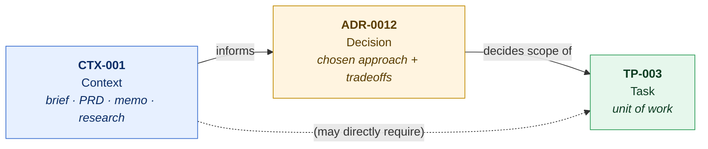
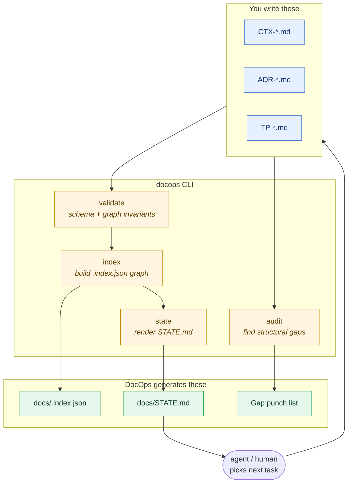
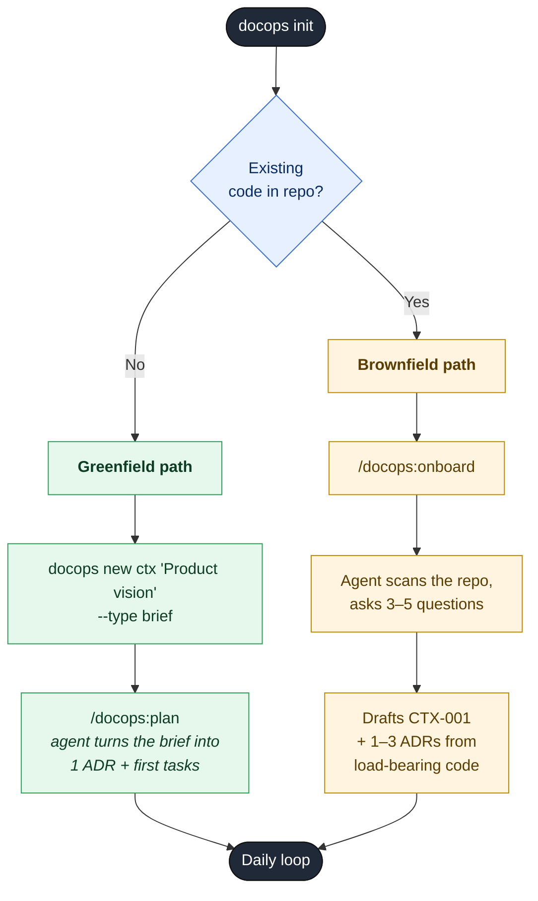
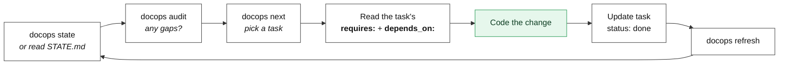

<div align="center">

# DocOps

**Typed project-state substrate for LLM-first development**

[](LICENSE)
[](https://goreportcard.com/report/github.com/logicwind/docops)
[](https://github.com/logicwind/DocOps/releases)

[Core concepts](#core-concepts) · [Install](#install) · [Onboarding](#onboarding-flow) · [Quickstart](#quickstart) · [Daily workflow](#daily-workflow) · [CLI reference](#cli-reference)

</div>

---

> **DocOps is in active development.** Shipped and stable: `init`, `upgrade`, `update-check`, `validate`, `index`, `state`, `audit`, `refresh`, `schema`, `new`, `get`, `list`, `graph`, `next`, `search`, `html`, `serve`. On the roadmap: `amend`, `review`, `status`. See [`docs/STATE.md`](docs/STATE.md) for what's live and what's coming.

## Why DocOps?

Coding agents (Claude Code, Cursor, Aider, Codex, Copilot CLI, Windsurf) land in a repo and immediately ask: *what are we building, what was decided, and what's next?* When that context lives in Slack threads, Jira tickets, or tribal knowledge, agents — and humans — guess.

DocOps puts three document types in `docs/`, typed with YAML frontmatter, linked with explicit edges, and validated by a CLI. The key invariant: **every task must cite at least one decision or context document.** `docops validate` enforces this. This is the alignment contract — it prevents drift between "what we're building" and "what we said we'd build."

No other tool in the space enforces this.

## Core concepts

Three document types, three roles. Read this once and the rest of the docs make sense.

| Prefix | Type | Folder | Answers | Example |
|---|---|---|---|---|
| **`CTX-`** | Context | `docs/context/` | *Why are we doing this?* | `CTX-001-product-vision.md` (a PRD, memo, research note, or brief) |
| **`ADR-`** | Decision | `docs/decisions/` | *What did we choose, and why this over the alternatives?* | `ADR-0012-pick-sqlite.md` |
| **`TP-`** | Task | `docs/tasks/` | *What concrete work falls out of that decision?* | `TP-003-wire-sqlite.md` (cites `ADR-0012`) |



**Reading order for a new contributor (or agent):**

1. **CTX** for the *why* — start with `CTX-001` if it exists; it's the product brief.
2. **ADR** for the *how* it was decided — frontmatter `status:` tells you if it's `draft`, `accepted`, or `superseded`.
3. **TP** for the *what* you can pick up — every task lists its `requires:` (citations) and `depends_on:` (other tasks).

**The alignment contract:** a task with no `requires:` field fails `docops validate`. You cannot ship work that isn't traceable to a decision or stakeholder input.

## How it works

```
docs/
  context/CTX-001-vision.md       ← stakeholder intent
  decisions/ADR-0001-pick-db.md   ← how we chose
  tasks/TP-003-wire-sqlite.md     ← what to build (cites ADR-0001)
  .index.json                     ← computed graph (don't edit)
  STATE.md                        ← generated snapshot (don't edit)
docops.yaml                       ← project config (context types, gap thresholds)
```



1. **`docops init`** scaffolds folders, schemas, agent skills, and `AGENTS.md`/`CLAUDE.md` into any git repo.
2. **`docops new`** creates documents with auto-allocated IDs and validated frontmatter.
3. **`docops validate`** checks schema and graph invariants (citations resolve, no dangling refs, task alignment rule).
4. **`docops index`** builds the enriched graph; **`docops state`** renders a human-readable snapshot.
5. **`docops audit`** finds structural gaps: accepted decisions with no tasks, stalled tasks, stale reviews.
6. **Agents read `STATE.md` → pick a task → read its cited ADRs → code → update status → `docops refresh`.**

The CLI is the query and mutation API. Every read command supports `--json` for scripting. See [ADR-0018](docs/decisions/ADR-0018-cli-as-query-layer.md) for the design rationale.

## Install

### macOS / Linux (Homebrew)

```sh
brew install logicwind/tap/docops
```

### Windows (Scoop)

```sh
scoop bucket add logicwind https://github.com/logicwind/scoop-bucket
scoop install docops
```

### Beta channel

Opt-in prereleases (`vX.Y.Z-beta.N`, `-alpha.N`, `-rc.N`) ship to a parallel formula / manifest in the same tap and bucket. Stable installs are unaffected.

```sh
brew install logicwind/tap/docops@beta   # macOS / Linux
scoop install docops-beta                # Windows (after `scoop bucket add logicwind ...`)
```

See [ADR-0032](docs/decisions/ADR-0032-beta-release-channel-via-beta-tap-formula.md) for the channel design.

### Direct download

Grab the archive for your platform from [GitHub Releases](https://github.com/logicwind/DocOps/releases), extract, and put `docops` on your PATH.

### Docker and npm

Docker image (GHCR) and npm convenience shims (`@docops/cli`) are planned for a future release. See [ADR-0012](docs/decisions/ADR-0012-language-agnostic-distribution.md) for the distribution rationale.

## Onboarding flow

DocOps detects whether your repo is **greenfield** (empty) or **brownfield** (existing code) on `init` and routes you accordingly. Either path lands you at the same daily loop.



## Quickstart

From the root of any git repo:

```sh
docops init                                          # scaffold everything (idempotent)
```

Then follow the path that matches your repo:

```sh
# Greenfield (empty repo)
docops new ctx "Product vision" --type brief        # capture stakeholder intent
# → then run /docops:plan in your agent (Claude Code, Cursor, etc.)

# Brownfield (existing code)
# → run /docops:onboard in your agent — it drafts CTX-001 + ADRs from the code
```

After that, the daily loop is the same:

```sh
docops new adr "Pick a database"                     # capture a decision
docops new task "Wire up SQLite" --requires ADR-0001 # task citing the decision
docops refresh                                       # validate + index + state in one pass
docops audit                                         # find structural gaps
docops next                                          # ask DocOps what to pick up next
```

Every mutating command ends with a `→ Next:` block of suggested follow-ups. Add `--quiet` to suppress, or `--json` for programmatic output (suggestions arrive in a `next_steps` array).

`docops init` flags: `--dry-run` (preview), `--force` (re-sync drifted files), `--no-skills` (skip agent skill scaffolding), `--json` (structured output).

## Daily workflow

The loop you (or your agent) run every session:



The contract: **before coding, you must read every doc the task `requires:`.** That's how the agent (or a new contributor) inherits the *why*, not just the *what*.

## Upgrading

```sh
brew upgrade docops              # or scoop update docops
docops upgrade                   # sync skills, schemas, AGENTS.md
docops upgrade --dry-run         # preview first
```

`docops upgrade` only touches DocOps-owned scaffolding. To also rewrite `docops.yaml` or reinstall the pre-commit hook, use `--config` or `--hook`. Run `docops update-check` to see if a new version is available.

## CLI reference

Grouped by purpose. All commands support `--json` for structured output. Run `docops <command> --help` for details.

**Setup & maintenance**

| Command | What it does |
|---|---|
| `docops init` | Scaffold DocOps into a repo (idempotent) |
| `docops upgrade` | Refresh DocOps-owned files in an existing project |
| `docops update-check` | Probe upstream for a newer release (cached) |
| `docops schema` | (Re)write JSON Schemas from `docops.yaml` |

**Authoring**

| Command | What it does |
|---|---|
| `docops new ctx "title" --type <type>` | Create a context document (`CTX-NNN`) |
| `docops new adr "title"` | Create a decision record (`ADR-NNNN`) |
| `docops new task "title" --requires ADR-...,CTX-...` | Create a task (`TP-NNN`) — citation is required |

`docops new` accepts `--body TEXT`, `--body -` (stdin heredoc), or `--body-file PATH` to populate the body at creation. Use them to skip the stub-then-rewrite round-trip.

**Validation & generation**

| Command | What it does |
|---|---|
| `docops validate` | Schema + graph invariants; exits non-zero on errors |
| `docops index` | Build `docs/.index.json` (enriched graph) |
| `docops state` | Regenerate `docs/STATE.md` (counts, active work, gaps) |
| `docops audit` | Structural gap punch list |
| `docops refresh` | `validate` + `index` + `state` in one pass |

**Query**

| Command | What it does |
|---|---|
| `docops get <ID>` | Look up one document by ID |
| `docops list` | List docs with filters (`--kind`, `--status`, `--tag`) |
| `docops graph <ID>` | Typed edge graph from a starting doc |
| `docops next` | Recommend the next task to work on |
| `docops search <query>` | Substring/regex search over title, tags, body |

**Browse**

| Command | What it does |
|---|---|
| `docops html` | Emit a browsable HTML viewer to `docs/.html/` |
| `docops serve` | Localhost web viewer on `:8484` — sidebar, graph, live |

For lookups, prefer `docops list|get|search|graph|next` over loading `docs/.index.json` into agent context.

### Changing a published ADR

ADRs are append-only once accepted. Pick the right lane for the change:

| Change shape | Lane | What runs |
|---|---|---|
| Typo, dead link, errata, late-binding fact, clarification | **amend** | Add an entry under `amendments:` in the ADR's frontmatter (`kind`: `editorial` \| `errata` \| `clarification` \| `late-binding`). `docops amend` CLI verb is on the roadmap. |
| The decision itself changes (different choice, reversal, scope flip) | **supersede** | New ADR with `supersedes: [<old>]` — the back-pointer is computed by `docops index` |
| Decision stands but its scope tightens or expands | **revise** | Add a `clarification` amendment + a follow-up task if load-bearing |

The amendments **data model** ships today (validator, index, STATE, HTML viewer all understand it). See [ADR-0025](docs/decisions/ADR-0025-amendments-as-first-class-decision-metadata.md).

### HTML viewer

`docops serve --open` spins up a localhost web UI for the current repo: sidebar by kind (CTX / ADR / TP), frontmatter + rendered markdown on the right, and an interactive graph tab. Hover a node to focus its neighborhood, single-click to pin, double-click to open the doc. Works on any modern browser; no install, no framework — the SPA pulls Tailwind / `marked` / `cytoscape` from jsDelivr on first load.

## Editor integration

`docops init` (and `docops schema`) write JSON Schemas to `docs/.docops/schema/`. Install [`redhat.vscode-yaml`](https://marketplace.visualstudio.com/items?itemName=redhat.vscode-yaml) and add to your `.vscode/settings.json`:

```json
"yaml.schemas": {
  "./docs/.docops/schema/context.schema.json":  "docs/context/*.md",
  "./docs/.docops/schema/decision.schema.json": "docs/decisions/*.md",
  "./docs/.docops/schema/task.schema.json":     "docs/tasks/*.md"
}
```

## What DocOps is not

DocOps is a **substrate**, not a framework. It provides typed state — not workflow, not orchestration, not personas, and not code generation. See [ADR-0014](docs/decisions/ADR-0014-positioning-substrate-not-harness.md) for the full scope boundaries.

- Not a phase orchestrator (that's GSD's domain).
- Not a role/persona system (that's GStack's domain).
- Not a code generator or execution harness.
- Not a hosted dashboard or issue tracker.

## Documentation

- **[`docs/STATE.md`](docs/STATE.md)** — current project state (auto-generated)
- **[`docs/context/`](docs/context/)** — stakeholder inputs and research
- **[`docs/decisions/`](docs/decisions/)** — architecture decisions (ADRs)
- **[`docs/tasks/`](docs/tasks/)** — work items with citation requirements
- **[`AGENTS.md`](AGENTS.md)** — orientation for coding agents working on DocOps itself
- **[`CHANGELOG.md`](CHANGELOG.md)** — release history

## Contributing

Issues, feature requests, and pull requests are welcome on [GitHub](https://github.com/logicwind/DocOps/issues). This repo dog-foods DocOps: all changes go through the same `validate` → `index` → `state` cycle.

See [`AGENTS.md`](AGENTS.md) for the orientation guide if you're an agent, and the Makefile targets for the local development workflow:

```sh
make tidy     # go mod tidy
make build    # builds bin/docops
make test     # go test -race ./...
make lint     # go vet ./...
```

## Developing on DocOps itself

This repository is the DocOps **source**, and it dog-foods its own convention. The root `AGENTS.md` separates the "meta" layer (this repo's own project management) from the "product" layer (what `docops init` emits into user repos). See [ADR-0016](docs/decisions/ADR-0016-meta-vs-product-separation.md).

### Release

Two channels: **stable** for everyone, **beta** for opt-in testers and your own dogfooding. Full runbook in [`CTX-005`](docs/context/CTX-005-release-runbook-stable-and-beta-channels.md).

```sh
# fast loop — tweak source, test in another project on this machine
make install

# dogfood — cut a prerelease from any branch
make beta VERSION=0.6.1-beta.1

# promote — once the beta has held up, cut stable from clean main
make release VERSION=0.6.1
```

Tag pushes trigger `.github/workflows/release.yml`, which runs goreleaser to build the matrix, attach artifacts to the GitHub Release, and update the Homebrew/Scoop stubs. Prerelease tags route to `docops@beta` / `docops-beta` only; stable tags route to `docops` / `docops`.

Dry-run: `make release VERSION=0.4.1 DRY_RUN=1`. Local snapshot (no tag, no push): `make release-snapshot`.

## License

MIT © [Logicwind Technologies Pvt Ltd](https://logicwind.com) — see [`LICENSE`](LICENSE).

DocOps is built and maintained by [Logicwind](https://logicwind.com).