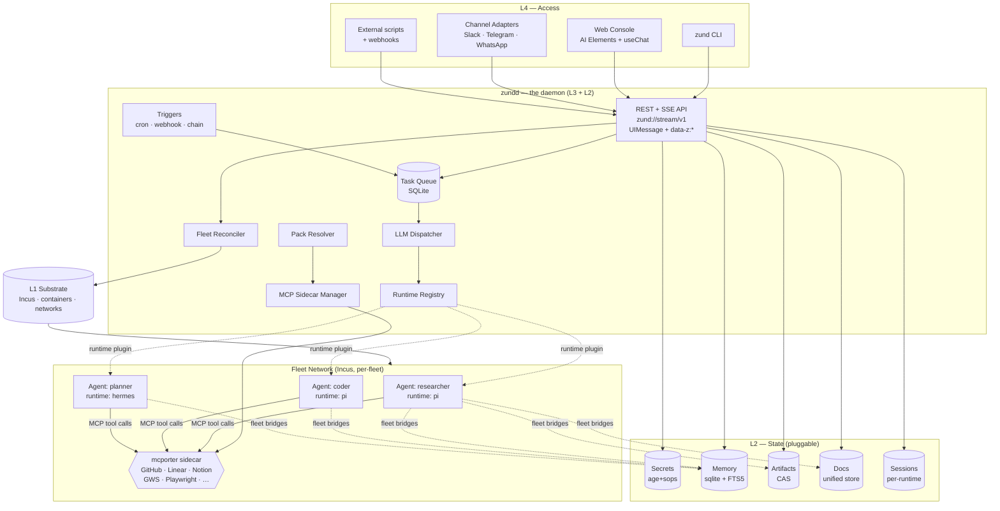
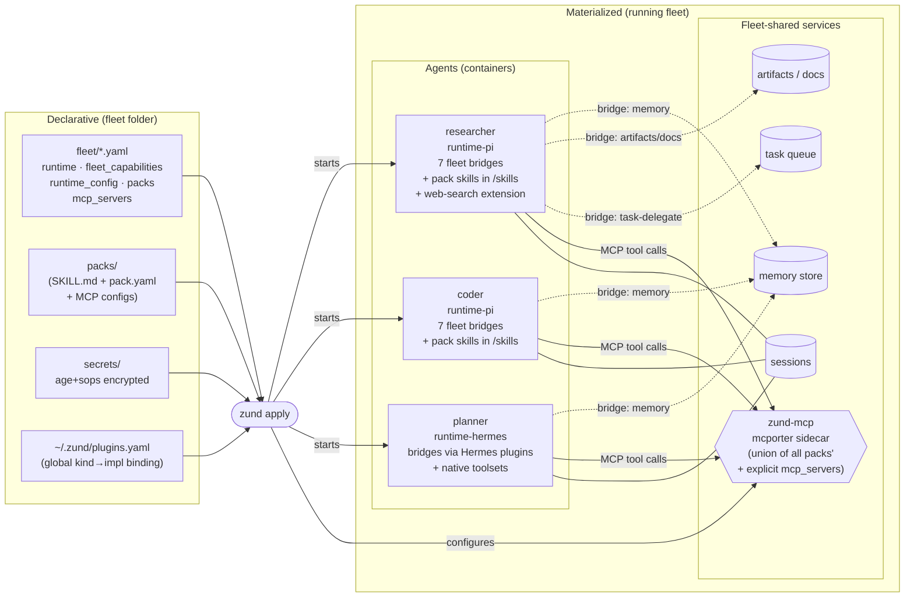

# Zund Diagrams

Two mermaid diagrams that make the system visible. Render in any
mermaid-capable viewer (GitHub, Fumadocs, mermaid.live).

- **System architecture** — how the moving parts fit: daemon, runtimes,
  sidecars, state, clients. One-page read.
- **Fleet anatomy** — what a running fleet looks like after `zund apply`:
  declarative inputs, per-fleet shared services, per-agent bridges.

For the layer-by-layer walkthrough, see `architecture.md`. For the
vocabulary and concept relationships, see `mental-model.md`.

---

## System architecture

How the daemon, fleet network, state, and clients connect. Grouped by
role; arrows show control + data flow.

**How to read:**

- **Access layer** talks only to `zundd`. No client ever touches a
  container, an MCP server, or a state store directly.
- **zundd** owns the fleet: reconciling YAML to running containers,
  routing tasks, streaming events, resolving packs, managing the MCP
  sidecar lifecycle.
- **Fleet network** is a per-fleet Incus network. Every agent (of any
  runtime) plus one shared mcporter sidecar lives here.
- **State stores** are pluggable (ADR 0020). Defaults are SQLite +
  local CAS + age/sops; swap via `~/.zund/plugins.yaml`.
- **Fleet bridges** (dotted) are the capability contract from ADR 0028:
  every runtime plugin wires its agents through to memory, artifacts,
  docs, fleet-status, task-delegate.

---

## Fleet anatomy

What `zund apply` turns YAML into. Same fleet, two views: left is what
you declare; right is what the daemon materializes.

**How to read:**

- **Left side** is everything a team checks into git: fleet YAML, pack
  manifests (skill + MCP + secrets), encrypted secret files, and the
  global plugin selection. Human-editable, reviewable.
- **`zund apply`** is the boundary between declared and materialized.
  It reads the left side, resolves secret refs, unions pack MCP configs
  into sidecar config, copies skill files into each agent's workspace,
  and starts/updates containers.
- **Right side** is what runs: one container per agent plus one
  sidecar per fleet for MCP. All agents share the fleet's state stores
  and the mcporter sidecar, via runtime-specific bridges.
- **Bridges vs MCP calls.** Fleet capabilities (memory, artifacts,
  docs, task-delegate) are bridged in-process by the runtime plugin
  (low latency, deep integration). MCP-tier capabilities (GitHub,
  Linear, Playwright, …) are called through the shared sidecar.
- **Runtimes are interchangeable.** The `planner` agent runs Hermes
  instead of Pi; the fleet contract is identical. Its `runtime_config:`
  pass-through configures Hermes's toolsets and backends natively; its
  fleet bridges are implemented by the Hermes runtime plugin rather
  than Pi's extension generators.

---

## When the diagrams drift

Update this file the same PR that changes the wire, adds a plugin
kind, or renames a fleet primitive. The mental model doc's glossary
should agree with every node label in these diagrams — if it doesn't,
one of them is wrong.
